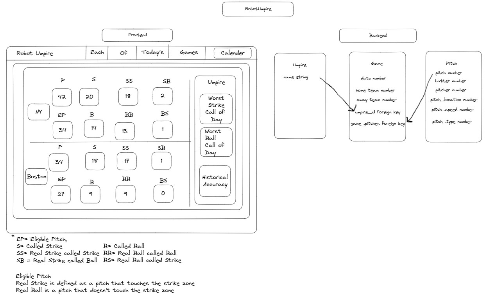
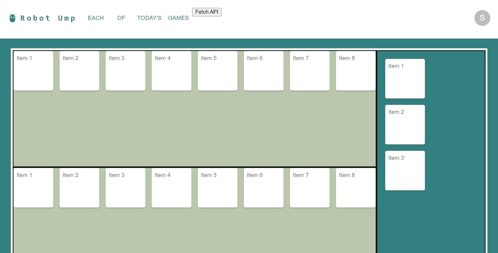

# Robot Umpire

## Description

A website that displays the accuracy of the strike/ball decisions in an MLB game.
Robot Umpire is intended to show how severe the human error is behind the plate.
This app will connect to the MLB API to display the MLB schedule each day. 
Strike zone statistics will be fetched as well. 
Under my criteria- If a pitch touches the strike zone box it is considered a real strike. If it does not, it's considered a ball.
This is a full stack app that uses React, MongoDB, Express.js, Node.js and GraphQL.
Material UI is used for components in the front end. App is not yet deployed.

## Table of Contents

- [Usage](#usage)
- [About](#about)
- [Contact](#contact)

## Usage
Select a game to display pitch data.

## About
What are all the possibilities for a pitch?

1. Batter doesn’t swing, pitch touch box- Called Strike (correct call)
2. Batter doesn’t swing, pitch touch box- Called Strike (wrong call)
3. Batter doesn’t swing, pitch outside box- Called ball (correct call)
4. Batter doesn’t swing, pitch touch box- Called ball (wrong call)
5. Batter does swing, makes contact, either hit, out, foul (ineligible pitch)
6. Batter does swing, misses, strike (ineligible pitch)

## Contact
[LinkedIn](https://github.com/mattflug)
mbflug@gmail.com

